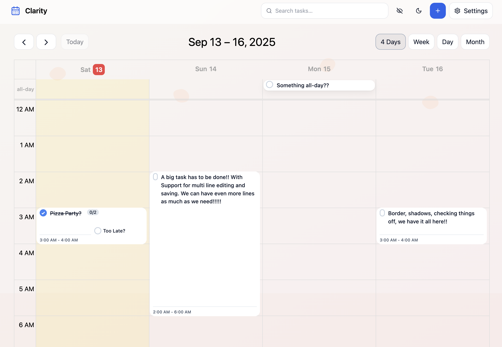
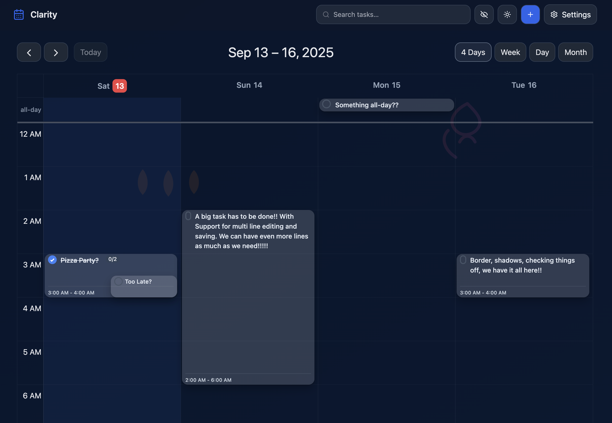
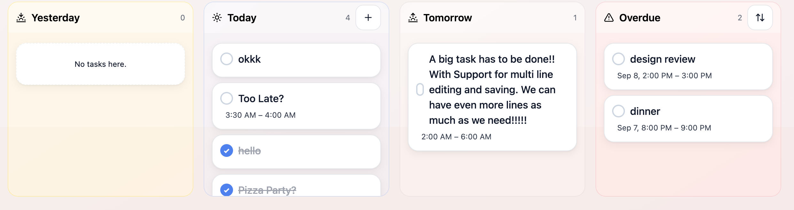
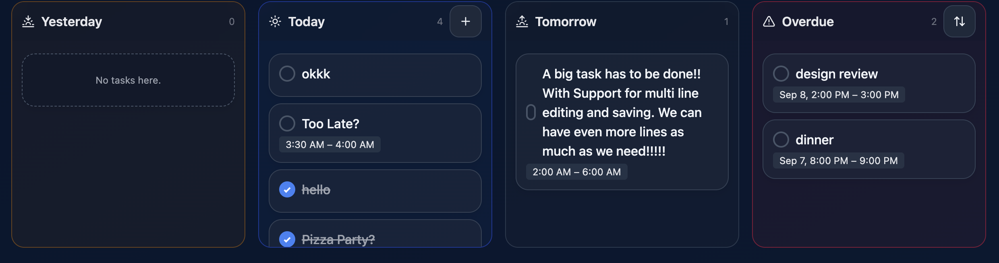

# Clarity

Local‑first Calendar + To‑Do PWA. Your tasks and events are stored entirely in your browser (SQLite Wasm + OPFS), work offline by default, and the app is installable as a PWA.

Built with Next.js (App Router), React, TypeScript, Tailwind CSS, FullCalendar, Zustand, and Serwist.

## Features
- Local‑first data: SQLite Wasm via a Web Worker with OPFS for persistent storage; automatic in‑memory fallback if OPFS isn’t available.
- Calendar + Board: FullCalendar view with drag/resize; Kanban board with Yesterday/Today/Tomorrow/Overdue columns and drag‑and‑drop between columns.
- Quick Add: Cmd/Ctrl+K opens a natural‑language quick add (e.g., "Design review" tomorrow 2 PM !event).
- Keyboard friendly: Quick Add (Cmd/Ctrl+K), close dialogs (Esc), toggle done on a task card (Space), create follow‑up (L), toggle hide‑done (Shift+D).
- Search + Filters: Instant search, + “hide done” toggle.
- Import/Export: Export as ICS (VEVENT/VTODO) or CSV; import tasks from CSV.
- PWA: Installable, offline‑capable; update notification when a new version is available.
- Theming: Light/Dark theme with automatic detection and persistent preference; dynamic background illustrations.
- Accessibility: Icon buttons have labels; calendar events include descriptive aria‑labels.

## Screenshots
Screenshots are available in `public/screenshots/` and linked below.

### Calendar View

| | |
|---|---|
|  |  |
| Light mode | Dark mode |

### Todo View

| | |
|---|---|
|  |  |
| Light mode | Dark mode |

## Getting Started

Requirements
- Node >= 18.18.0 (Node 20 LTS recommended)

Local setup
1) `nvm use` (or install/use Node 20 if prompted)
2) `npm install`
3) `npm run dev` (development server)

Production build
- `npm run build && npm run start`

Notes
- In development, the service worker is disabled. In production, the PWA is enabled and installable.
- OPFS + SQLite Wasm requires COOP/COEP headers, configured in `next.config.mjs`. Some browsers require a secure context (https).

## Configuration
- `NEXT_PUBLIC_SITE_URL`: Set to your production origin for correct sitemap/SEO links (e.g., `https://your-domain.com`). See `app/sitemap.ts` and `public/robots.txt`.
- `NEXT_PUBLIC_GOOGLE_CLIENT_ID` (optional): Controls visibility of a “Connect Google Calendar (beta)” button in Settings. The local‑only app does not perform a real OAuth flow or remote sync.

## Development
- Framework: Next.js 15 (App Router), React 18, TypeScript.
- Styling: Tailwind CSS.
- Calendar: FullCalendar (`@fullcalendar/react` + day/time grid + interaction plugin).
- Drag and drop: `@dnd-kit`.
- State: Zustand.
- Validation/Parsing: Zod, date‑fns, `chrono-node` for natural‑language dates.
- PWA: Service worker via Serwist (`@serwist/next`) with precaching; disabled in dev.
- Data: SQLite Wasm in a Web Worker (see `workers/db.worker.ts` and `src/lib/db.ts`).

Useful scripts
- `npm run dev`: Start dev server
- `npm run build`: Build for production
- `npm run start`: Start the production server
- `npm run lint`: Lint the project

## Keyboard Shortcuts
- Cmd/Ctrl+K: Open Quick Add
- Esc: Close dialogs
- Space (focused task card): Toggle done
- L (focused task card): Create follow‑up task
- Shift+D: Toggle “hide done”

## Data & Privacy
- Storage: All data is stored locally in your browser. When OPFS is supported, the database is persisted at `/clarity/main.sqlite3`; otherwise a transient in‑memory fallback is used.
- Backup/Export: Use Settings → Export to download ICS or CSV. Use Import CSV to bring tasks back.
- Network: No backend or analytics are included; the app runs entirely on the client.

## Deployment
- Vercel: Supported. Set `NEXT_PUBLIC_SITE_URL` to your production URL for correct sitemap links.
- Static export: Not supported due to server features used by the Next.js App Router.
- Headers: COOP/COEP are added in `next.config.mjs` to enable OPFS + SQLite Wasm.

## Project Structure (high‑level)
- `app/`: App Router pages and layout (incl. `app/sitemap.ts` and Settings page)
- `src/components/`: UI components (Calendar, Task Board, Quick Add, Export modal, etc.)
- `src/lib/`: Client utilities (DB client, NLP, theme, export helpers, service worker client)
- `workers/`: Web Worker for SQLite Wasm + OPFS
- `public/`: PWA assets (manifest, icons, backgrounds, service worker output)

## Changelog
See `Changelog.md` for notable changes.

## Contributing
Issues and pull requests are welcome. If you plan a larger change, please open an issue first to discuss scope and approach.

## License
MIT — see `LICENSE` for details.
